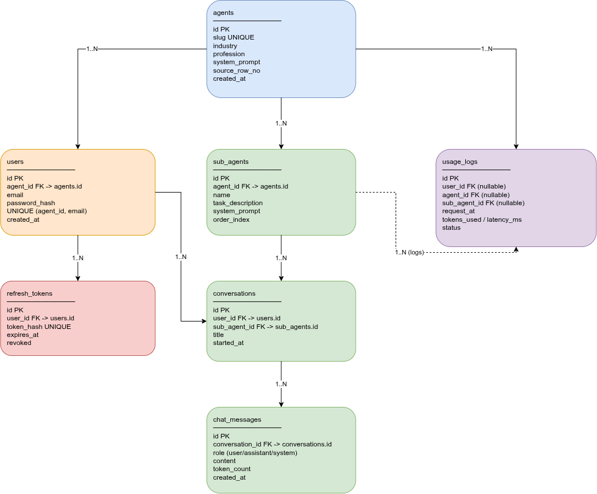

# AgentHub — AI Agent Playstore

A "Play Store" for AI agents: browse a catalog of ~100 profession-based AI
personas, sign up for one specifically, and chat with it (and its specialized
sub-agents) — every reply powered by a real LLM (Gemini).

## 🚀 Live Demo

| | |
|---|---|
| **Frontend** | [agent-hub-frontend-frkh.onrender.com](https://agent-hub-frontend-frkh.onrender.com) |
| **Backend API** | [agent-hub-backend-7vtg.onrender.com](https://agent-hub-backend-7vtg.onrender.com) |
| **API docs (Swagger)** | [agent-hub-backend-7vtg.onrender.com/docs](https://agent-hub-backend-7vtg.onrender.com/docs) |

> ⏳ **Heads up — first load takes ~30–60 seconds.**
> This is hosted on **free-tier** infrastructure, which puts services to sleep
> after a period of inactivity. Your **first click** wakes the server up — the
> page will show a friendly "waking up the server…" screen and retry
> automatically, no need to refresh manually. Once it's awake, everything runs
> at normal speed until it goes idle again.

## Test accounts

Login is **scoped per agent** — an account created for one agent doesn't work
for another (this is enforced server-side, verified with automated tests in
[backend/app/tests](backend/app/tests)). Below are 5 pre-created test
accounts, one per agent, covering the professions the assignment calls out by
name. All 5 are fully working (real Gemini replies) and each exposes 4
specialized sub-agents.

| Agent | URL | Email | Password |
|---|---|---|---|
| Doctor / Physician | [/agents/doctor-physician](https://agent-hub-frontend-frkh.onrender.com/agents/doctor-physician) | `agenthub.doctor-physician@gmail.com` | `ReviewMe#2026` |
| Corporate Lawyer | [/agents/corporate-lawyer](https://agent-hub-frontend-frkh.onrender.com/agents/corporate-lawyer) | `agenthub.corporate-lawyer@gmail.com` | `ReviewMe#2026` |
| Financial Controller | [/agents/financial-controller](https://agent-hub-frontend-frkh.onrender.com/agents/financial-controller) | `agenthub.financial-controller@gmail.com` | `ReviewMe#2026` |
| Software Developer | [/agents/software-developer](https://agent-hub-frontend-frkh.onrender.com/agents/software-developer) | `agenthub.software-developer@gmail.com` | `ReviewMe#2026` |
| Teacher | [/agents/teacher](https://agent-hub-frontend-frkh.onrender.com/agents/teacher) | `agenthub.teacher@gmail.com` | `ReviewMe#2026` |

Each of these accounts only logs in on its own agent's URL — trying the same
email/password combo under a different agent's `/agents/<slug>` page fails.

Prefer to test signup yourself instead of using the accounts above? Any of the
other ~95 agents in the catalog work the same way: pick one from the homepage,
click it, and use the **Sign up** tab with any email/password — no invite or
approval needed.

## What it does

- Browse a catalog of AI agents, each one a distinct profession persona
  (e.g. Financial Controller, Loan Officer, Relationship Manager)
- Sign up / log in **scoped to one agent** — your account only ever talks to
  that agent
- Chat with the main agent persona, or switch to one of its specialized
  sub-agents, each with its own focused system prompt
- Every reply is generated live by Google's Gemini API — no canned responses

## Architecture




## Tech stack

| | |
|---|---|
| **Frontend** | Next.js (App Router), React, Tailwind CSS |
| **Backend** | FastAPI (async), SQLAlchemy 2.0 + Alembic, PostgreSQL, Redis |
| **LLM** | Gemini `generateContent` REST API (direct `httpx` call, no SDK) |
| **CI** | GitHub Actions (separate pipelines for `frontend/` and `backend/`) |
| **Hosting** | Render (both services), Upstash (Redis) |

## AI-assisted development disclosure

**Claude Code** (Anthropic's CLI agent) was used as a coding assistant on
both sides of this project, not as a from-scratch generator:

- **Backend** — started from the author's own existing multi-tenant SaaS
  boilerplate (auth, DB setup, project layout) from a prior project. Claude
  Code was used to adapt that boilerplate to this assignment: converting the
  existing tenant model into the agent/sub-agent scoping this assignment
  needed, building the chat/LLM-integration module and the CSV→agent content
  pipeline, writing tests/CI, and debugging real issues found while running
  the live API — not just reviewing code statically. Full detail:
  [backend/README.md](backend/README.md#ai-assisted-development-disclosure).
- **Frontend** — built with Claude Code's help for the Next.js app (pages,
  components, the auth/chat flow, deployment fixes).

Every change was reviewed, tested, and committed incrementally by the
author — this was assisted development on an existing foundation, not
unreviewed AI output.

## Repo structure

```
.
├── backend/    FastAPI service — see backend/README.md for local setup
└── frontend/   Next.js app     — see frontend/README.md for local setup
```

Each folder has its own README with full local development instructions
(env vars, running migrations, seeding the agent catalog, running tests).

## Running locally

```bash
# Backend
cd backend
python -m venv venv && source venv/bin/activate
pip install -r requirements-dev.txt
cp .env.example .env   # fill in SECRET_KEY, LLM_API_KEY
alembic upgrade head
python -m scripts.seed_agents
uvicorn app.main:app --reload

# Frontend (separate terminal)
cd frontend
npm install
cp .env.example .env.local   # BACKEND_URL=http://localhost:8000
npm run dev
```

See [backend/README.md](backend/README.md) and [frontend/README.md](frontend/README.md)
for details.
